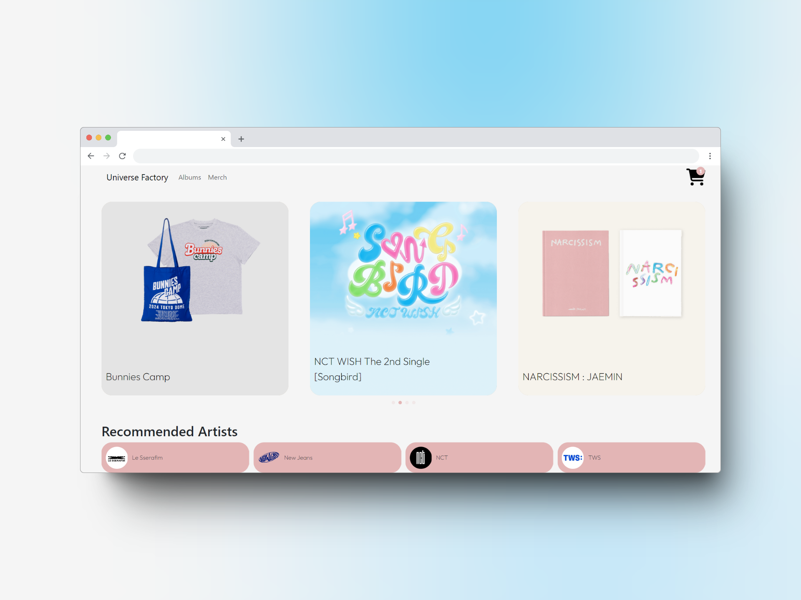
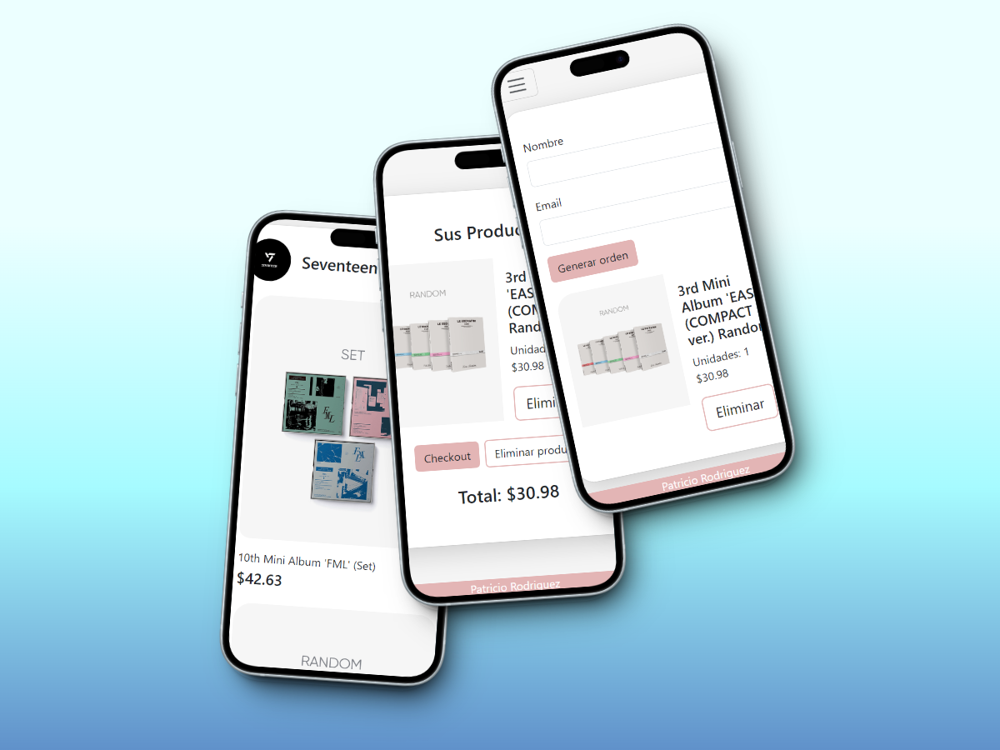
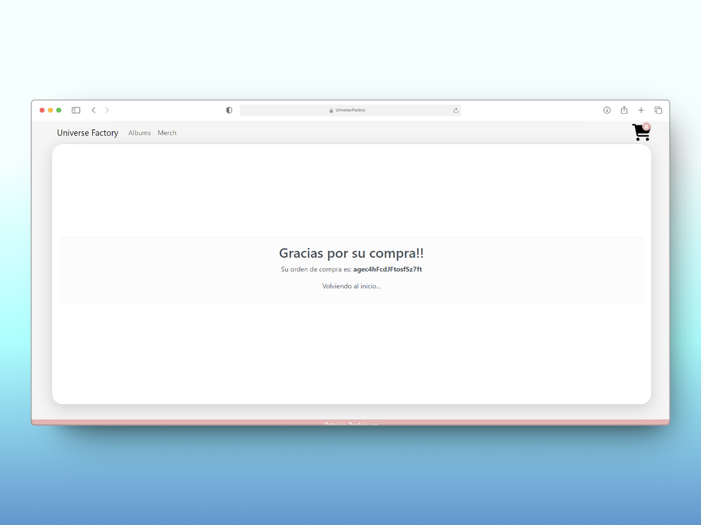
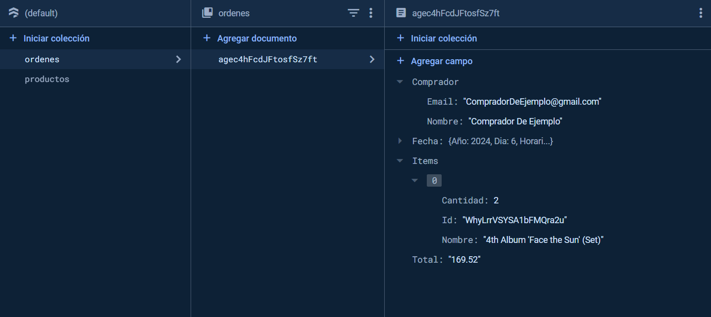

# ⚛️ Proyecto Final ReactJS
¡Bienvenido/a al repositorio de mi proyecto final de CoderHouse!

## 📦 Descripción del Proyecto
Este proyecto es el resultado de mi trabajo durante el curso de CoderHouse. Pude crear una aplicación web interactiva utilizando ReactJS y Vite, siguiendo buenas prácticas de desarrollo y utilizando librerías como Luxon, Swiper, React Router DOM y React Loading Skeleton. Este proyecto simula un e-commerce de venta de álbumes y merch de K-pop.

## 🔨 Funcionalidades del proyecto
- `Obtención de datos desde base de datos (Firebase - Firestore)`: Implementación de la integración con Firebase Firestore para recuperar los datos de productos y renderizarlos en la aplicación.
- `Simulación de compra`: Creación de un flujo de compra donde los usuarios pueden seleccionar productos y proceder al checkout.
- `Generación de orden de compra para su posterior manejo`: Creación de órdenes de compra con un formato estructurado para su almacenamiento y procesamiento posterior.

## 🛠️ Herramientas principales

## 📸 Imagenes del proyecto

## ❔Donde puedo ver el proyecto? 
Puedes ver el proyecto en: [Universe Factory Shop](https://universe-factory.vercel.app/).